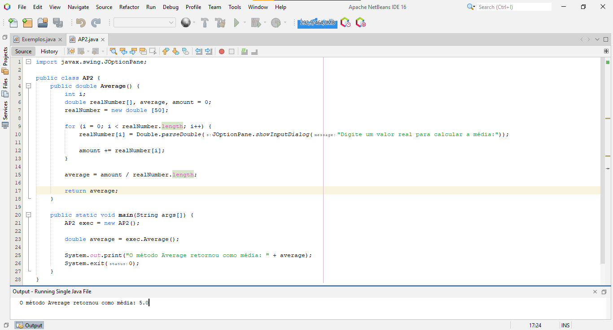

###### Atividade Prática
## Entendendo Vetores e Matrizes 📝
<br/>

**Título da Prática:** Aplicação prática de vetor
<br/><br/>

**Objetivos:** O aluno precisa transcrever o pseudo-código e codificar em java o que foi especificado.
<br/><br/>

**Materiais, Métodos e Ferramentas:** O aluno precisa ter um programa de edição de texto para poder codificar. O software indicado para isso é o Apache NetBeans IDE 16. Contudo, pode ser utilizado qualquer software de edição de texto.
<br/><br/>

**Atividade Prática**
Quando escrevemos um algoritmo que recebe 50 números reais em um vetor, para calcular e mostrar a média aritmética destes 50 números, temos como exemplo o algoritmo seguinte:

```java
Algoritmo Media

    início_algoritmo

        // declaração de variáveis e/ou constantes
        Declarar
            i numérico_inteiro;

            Num [50] , media, soma ← 0 numérico_real;

        // processamento de dados
        para i de 0 até 49 passo + 1 faça
            // mensagem ao usuário
            escrever (“Digite um número”);

            // entrada de dados
            ler (Num[i]);

            soma ← soma + Num[i];
        fimpara;

        // processamento de dados
        media ← soma/50;

        // saída de resultados
        escrever ("A média das 50 notas digitadas é: " , media);

    fim_algoritmo.
```

Desenvolva o programa em Java deste algoritmo no NetBeans.

<br/><br/>

###### Exemplo:
