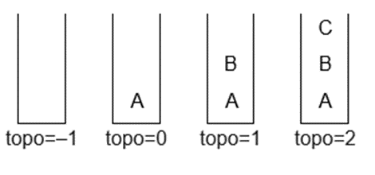
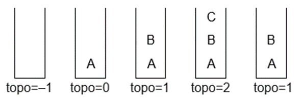
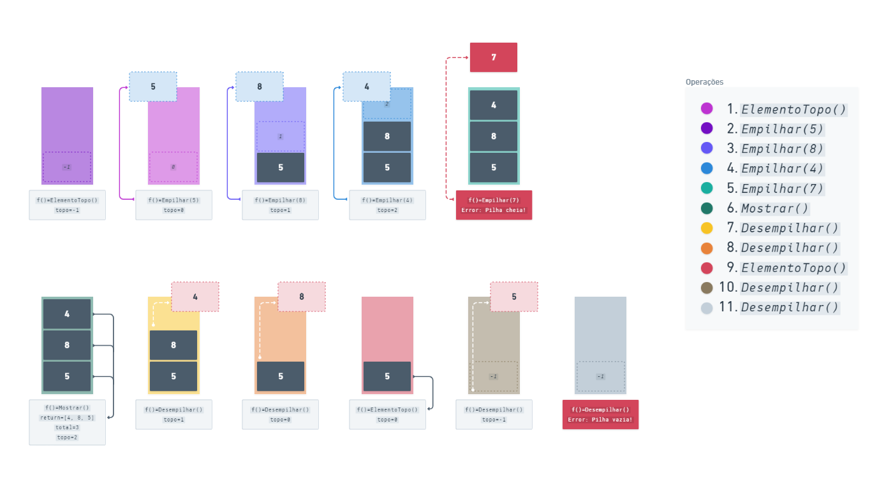

###### Atividade Prática
## Entendendo Pilha 📝
<br/>

**Título da Prática:** Aplicação prática de pilha
<br/><br/>

**Objetivos:** O aluno precisa apresentar por meio de figuras o que foi especificado.
<br/><br/>

**Materiais, Métodos e Ferramentas:** O aluno precisa ter um programa de edição de imagem para poder criar. Os softwares indicados para isso é o **Paint** ou **Whimsical**. Contudo, pode ser utilizado qualquer software de edição de imagem.
<br/><br/>

**Atividade Prática**
Para mostrar os elementos da Pilha, vamos demonstrar com uma Pilha de letras.
Inicialmente esta pilha está `vazia`, ou seja, seu topo é igual a `-1`, conforme mostra a figura abaixo:


Vamos então empilhar a letra `A` na pilha, em seguida empilhar a letra `B` e depois a letra `C`, conforme a sequência abaixo. Perceba que o topo muda a cada letra que é empilhada:



Se quisermos desempilhar um elemento da pilha, só podemos fazer com o elemento do topo, veja a figura abaixo:



Da mesma forma como o modelo, considerando uma pilha de números inteiros de tamanho `3` que inicialmente está `vazia`, realize e apresente por meio de figuras, as seguintes operações:

```java
    ElementoTopo();
    Empilhar(5);
    Empilhar(8);
    Empilhar(4);
    Empilhar(7);
    Mostrar();
    Desempilhar();
    Desempilhar();
    ElementoTopo();
    Desempilhar();
    Desempilhar();
```

<br/><br/>

###### Exemplo:
