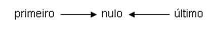
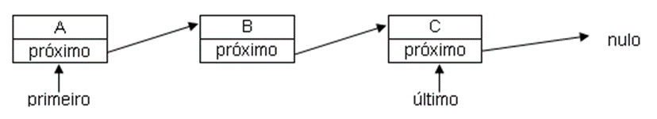
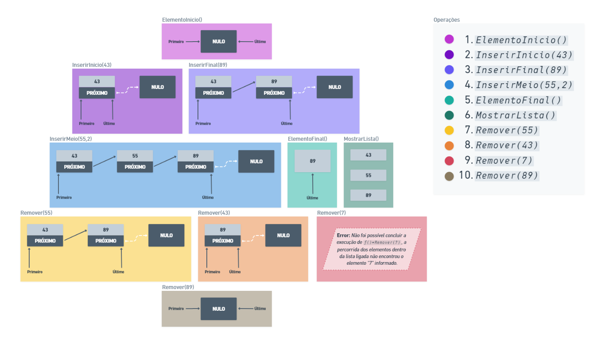

###### Atividade Prática
## Entendendo os Elementos Lista Ligada 📝
<br/>

**Título da Prática:** Aplicação prática de lista ligada
<br/><br/>

**Objetivos:** O aluno precisa apresentar por meio de figuras o que foi especificado.
<br/><br/>

**Materiais, Métodos e Ferramentas:** O aluno precisa ter um programa de edição de imagem para poder criar. Os softwares indicados para isso é o **Paint** ou **Whimsical**. Contudo, pode ser utilizado qualquer software de edição de imagem.
<br/><br/>

**Atividade Prática**
Para exemplificar como funciona uma lista ligada, vamos exemplificar com uma representação da lista ligada de letras como informações.
Logo que você começa a construção da lista ligada, ela está `vazia`, isso significa que não existem elementos na lista ligada. Neste caso, o `primeiro` e o `último` elementos da lista ligada estão apontando para `nulo`. Veja a figura:



Podemos inserir nesta Lista Ligada a letra `A`. Em seguida, podemos inserir a letra `B` e por último, podemos inserir a letra `C`, conforme a figura apresentada com a sequência.

Perceba que o tamanho da lista ligada muda a cada letra que é inserida. Temos o tamanho `1` quando está inserida apenas a letra `A`. O tamanho `2`, quando estão inseridas as letras `A` e `B` e, enfim, o tamanho `3`, quando estão inseridas as letras `A`, `B` e `C`.



Se você quiser remover um elemento desta lista ligada, você pode remover qualquer elemento, independentemente da posição em que estiver o elemento. Pode estar no início, no final e mesmo lá no meio da lista ligada.

Por exemplo, vamos remover a letra `B` da lista ligada e ver como fica a lista ligada:


Da mesma forma como o modelo, considerando uma lista ligada de `números inteiros` que inicialmente está `vazia`, realize e apresente por meio de figuras, as seguintes operações:

```java
    ElementoInicio();
    InserirInicio(43);
    InserirFinal (89);
    InserirMeio (55,2);
    ElementoFInal();
    MostrarLista();
    Remover(55);
    Remover(43);
    Remover(7);
    Remover(89);
```

<br/><br/>

###### Exemplo:
