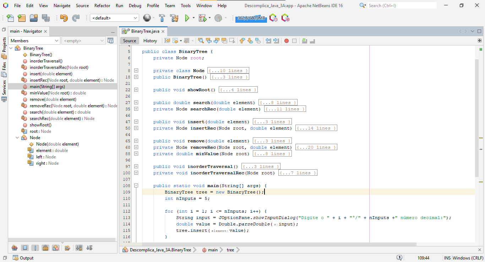

###### Atividade Prática
## Entendendo Árvores Binárias 📝
<br/>

**Título da Prática:** Aplicação prática de Árvore Binária de Busca
<br/><br/>

**Objetivos:** O aluno precisa transcrever o pseudo-código e codificar em java o que foi especificado.
<br/><br/>

**Materiais, Métodos e Ferramentas:** O aluno precisa ter um programa de edição de texto para poder codificar. O software indicado para isso é o Apache NetBeans IDE 16. Contudo, pode ser utilizado qualquer software de edição de texto.
<br/><br/>

**Atividade Prática**
O Algoritmo de manipulação das operações de Árvore Binária de Busca para desenvolver um algoritmo que recebe do usuário cinco números reais numa árvore binária e mostra esses números, pode ser escrito como segue.

Desenvolva o programa em Java deste algoritmo no NetBeans.

```java
Algoritmo BIntNo

início_algoritmo
    tipo BIntNo = registro
        valor  numérico_decimal;
        esq, dir BIntNo;
    fimregistro;
Fim_algoritmo.

Algoritmo ArvoreBinaria
início_algoritmo
    Declarar
        Raiz BIntNo;

BIntNo inserir (arvore BIntNo, novoNo numérico_decimal)
início_módulo
    se (arvore = nulo)
        então
            retornar novo BIntNo (novoNo);
    senão
    se (novoNo < arvore.valor)
        então
            arvore.esq ← inserir (arvore.esq, novoNo);
        senão
            arvore.dir ← inserir (arvore.dir, novoNo);
    fimse;
    fimse;

    retornar arvore;
fim_módulo;

inserirNo (novoValor numérico_decimal)
início_módulo
    Raiz ← inserir(Raiz, novoValor);
fim_módulo;

exibirEsquerdo (arv BIntNo)
início_módulo
    se (arv <> nulo)
        então
            exibirEsquerdo (arv.esq);
            escrever(arv.valor);
    fimse;
fim_módulo;

exibirNoEsq()
início_módulo
    exibirEsquerdo(Raiz);
fim_módulo;

exibirDireito (arv BIntNo)
início_módulo
    se (arv <> nulo)
        então
            exibirDireito(arv.dir);
            escrever (arv.valor);
    fimse;
fim_módulo;

exibirNoDir()
início_módulo
    exibirDireito(Raiz);
fim_módulo;

início_módulo
    exibirNoEsq( );
    exibirRaiz( );
    exibirNoDir( );
fim_módulo;

exibirRaiz()
início_módulo
    escrever("raiz " , Raiz.valor);
fim_módulo;

No (item numérico_inteiro)
início_módulo
    tempNo, pai, filho, temp   BIntNo;
    tempNo ← Raiz;
    pai ← null;
    filho ← Raiz;

    enquanto (tempNo <> nulo e tempNo.valor <> item) faça
        pai ← tempNo;
        se (item < tempNo.valor)
            então
                tempNo ← tempNo.esq;
            senão
                tempNo ← tempNo.dir;
        fimse;

        se (tempNo = nulo)
            então
                escrever(“item não localizado!”);
        fimse;

        se (pai = nulo)
            então
                se (tempNo.dir = nulo)
                então
                    Raiz ← tempNo.esq;
                senão
                    se (tempNo.esq = nulo)
                    então
                        Raiz ← tempNo.dir;
                    senão
                        para temp ← tempNo e filho ← tempNo.esq até filho.dir <> null
                        passo temp ← filho e filho ← filho.dir faça

                        fimpara;

                        se (filho <> tempNo.esq)
                        então
                            temp.dir ← filho.esq;
                            filho.esq ← Raiz.esq;
                        fimse;

                        filho.dir ← Raiz.dir;
                        Raiz ← filho;
                    fimse;
                fimse;

        senão
            se (tempNo.dir = nulo)
                então

                se (pai.esq = tempNo)
                    então
                    pai.esq ← tempNo.esq;
                    senão
                    pai.dir ← tempNo.esq;
                fimse;

                senão
                se (tempNo = nulo)
                    então
                        se (pai.esq = tempNo)
                            então
                                pai.esq ← tempNo.dir;
                            senão
                                pai.dir ← tempNo.dir;
                        fimse;

                    senão
                        para temp ← tempNo e filho ← tempNo.esq até filho.dir <> nulo
                        passo temp ← filho e filho ← filho.dir
                    fimpara;

                    se (filho <> tempNo.esq)
                        então
                            temp.dir ← filho.esq;
                            filho.esq ← tempNo.esq;
                    fimse;

                    filho.dir ← tempNo.dir;

                    se (pai.esq = tempNo)
                        então
                            pai.esq ← filho;
                        senão
                            pai.dir ← filho;
                    fimse;
                fimse;
            fimse;
        fimse;
    fimenquanto;
fimmódulo;
fim_algoritmo.

Algoritmo teste
início_algoritmo
    Declarar
        num numérico_inteiro;

    ArvoreBinaria arv ← novo ArvoreBinaria();

    ler(num);
    arv.inserirNo(num);

    ler(num);
    arv.inserirNo(num);

    ler(num);
    arv.inserirNo(num);

    ler(num);
    arv.inserirNo(num);

    ler(num);
    arv.inserirNo(num);

    arv.exibirNo();
Fim_algoritmo.
```

<br/><br/>

###### Exemplo:
